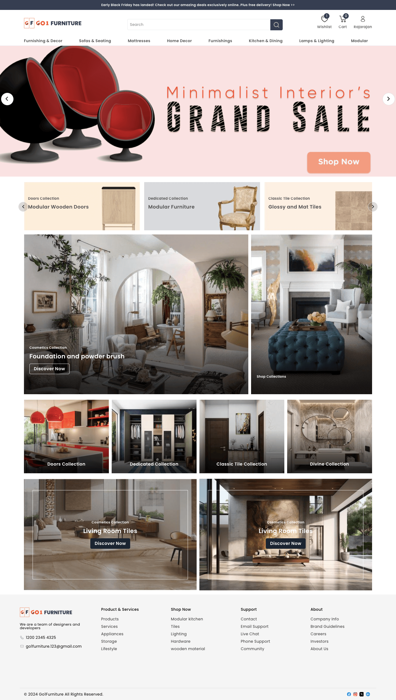

## Go1 Webshop

Go1 Webshop is an Open Source eCommerce portal built using frappe builder.



## Installation
1. [Install bench](https://github.com/frappe/bench).
2. [Install ERPNext](https://github.com/frappe/bench#installation).
3. [Install Webshop](https://github.com/frappe/webshop#installation).
4. [Install Builder](https://github.com/frappe/builder#installation).
5. Once Builder is installed, add the Go1 Webshop app to your bench by running

    ```sh
    $ bench get-app https://github.com/TridotsTech/Go1-Webshop
    ```
6. Then you have to install the Go1 Webshop app on the required site by running
    ```sh
    $ bench --site sitename install-app go1_webshop
    ```
7. Enable the server by running
    
     ```sh
    $ bench set-config -g server_script_enabled 1
    ```

#### Go1 Webshop Ecommerce Portal Pages

To get Go1 Webshop ecommerce portal pages follow the following steps

1. Go to Go1 Webshop Settings
2. In Settings, you have an option import pages.By clicking Import Pages button you will have the ecommerce pages with sample data.
3. After importing the pages , need to execute command for restting the routes
     ```sh
    $ bench --site sitename clear-cache
    ```